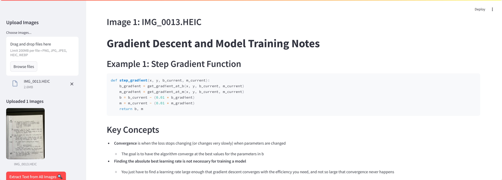
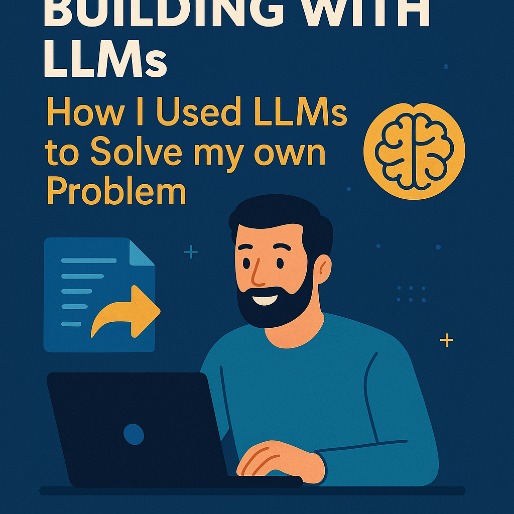

# OCR-Note-Transcriber

 

A smart document processing system that combines OCR with Large Language Models (LLMs) to transform handwritten notes and documents into organized digital formats.

**Blog Post**: [Building with LLMs: How I Used LLMs to Solve My Own Problem](https://medium.com/@nolanrobbins5934/building-with-llms-how-i-used-llms-to-solve-my-own-problem-925b42b63407)

## Features

- 📖 Handwritten text recognition using Claude 3.7 Sonnet
- 🧠 Context-aware text processing with Claude 3.7 Sonnet API
- ✅ Automatic formatting and error correction
- 🌐 Multi-language support
- 💡 Intelligent summarization and key point extraction
- 🔍 Contextual understanding of notes
- 📤 Markdown and text file export

